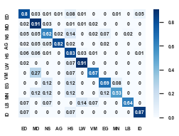
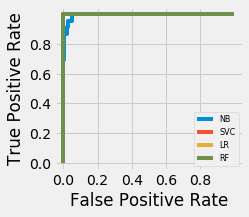

# About ETD Autoclassifier
A Flask API for classifying Electronic Theses and Dissertations prepared by students at [The University of Zambia](http://www.unza.zm).

## Demostration

A demo instance of the API has been deployed to [Heroku](https://www.heroku.com), with two endpoints for predicting ETD collections and ETD types.

### ETD collection classifier

* API endpoint: https://datalab-apis.herokuapp.com/api/collection
* Method: POST
* Input: JSON format with title and abstract fields, e.g.

`{
"title": "LECTURERS’ PREPAREDNESS TO TRAIN TEACHERS OF LITERACY AND LANGUAGE EDUCATION IN COLLEGES OF EDUCATION IN ZAMBIA",
"abstract": "The issue of literacy in Zambia has been the subject of concern due to the continued low literacy levels among Zambian pupils. Literacy should be the main focus if any improvement in the education system is to be done. The focus of literacy education is to improve the reading and writing skills of learners which should begin with teacher preparation. The purpose of this study was to establish whether Literacy and Language lecturers were adequately prepared to train teachers in literacy and language education in colleges of education in Zambia. The study sought to establish the preparedness of literacy and language lecturers to prepare teacher trainees in literacy and language education, establish whether the literacy and language teacher education programme adequately responds to the pedagogical needs of a teacher and establish challenges which literacy and language lecturers face in preparing trainee teachers in literacy and language education. The study employed a mixed method descriptive design which involved both qualitative and quantitative methods. A purposive sampling technique was used to come up with 49 respondents, that is, 45 college lecturers and four college administrators while simple random sampling was used to select colleges of education where data was collected. Data was collected through questionnaires and interviews. The study found that while all literacy and language lecturers were professionally trained either as primary school teachers or secondary school teachers, they were not fully prepared to train teachers in literacy and language education. This was due to the failure to interpret the literacy and language teacher education programme, the literacy and language teacher education curriculum not being totally in line with the school curriculum in most areas of literacy and language education and failure by the ministry to update literacy and language lecturers on the latest developments of the school curriculum and shortage of lecturers was among challenges. The study recommended that literacy and language lecturers need to be inducted and mentored upon appointment so as to prepare them to train teachers, the literacy and language curriculum should always be updated in line with the school curriculum in order for colleges of education to prepare students effectively, and there is need to engage literacy and language lectures in the formulation and /or revision of literacy policies."
}`

* Output: JSON format with collection code and collection name, e.g.

`{
    "collectionPrediction": {
        "collectionCode": 0,
        "collectionName": "Education"
    }
}`

### ETD type classifier

* API endpoint: https://datalab-apis.herokuapp.com/api/type
* Method: POST
* Input: JSON format with cover page text, e.g.

`{
"coverpage": "UNIVERSITY OF ZAMBIA AND ZIMBABWE OPEN UNIVERSITY POSTGRADUATE PROGRAMMES Effects of Outsourcing the performance of mining companies in Zambia. A case study of Konkola Copper Mines plc By Brown Kalela A dissertation submitted to the University of Zambia in collaboration with Zimbabwe Open University in partial fulfilment of the requirements for the award of the Degree of Master of Business Administration THE UNIVERSITY OF ZAMBIA 2018"
}`

* Output: JSON format with ETD type code and ETD type name, e.g.

`{
    "typePrediction": {
        "typeCode": 0,
        "typeName": "Masters"
    }
}`

## Classification Models

Empirical evaluation was conducted to determine optimal features and, additionally, effective estimators.

###  ETD type classifier

* Feature extraction 
    * (i) Text on coverpages 
    * (ii) Number of pages in manuscript
    * (iii) Text on coverpages + Number of pages

* Feature selection
    * Text on cover pages (Countvectorizer)

* Estimators
    * RandomForests
    
    `RandomForestClassifier(bootstrap=True, class_weight=None, criterion='gini',
            max_depth=None, max_features='auto', max_leaf_nodes=None,
            min_impurity_decrease=0.0, min_impurity_split=None,
            min_samples_leaf=1, min_samples_split=2,
            min_weight_fraction_leaf=0.0, n_estimators=10, n_jobs=None,
            oob_score=False, random_state=None, verbose=0,
            warm_start=False)`
    
* Experimental results

              precision    recall  f1-score   support

           0       0.99      1.00      1.00       661
           1       1.00      0.74      0.85        23

   micro avg       0.99      0.99      0.99       684
   macro avg       1.00      0.87      0.92       684
weighted avg       0.99      0.99      0.99       684

### ETD collection classifier

* Estimators 
    * SDG
    
    `SGDClassifier(alpha=0.0001, average=False, class_weight=None,
       early_stopping=False, epsilon=0.1, eta0=0.0, fit_intercept=True,
       l1_ratio=0.15, learning_rate='optimal', loss='hinge', max_iter=None,
       n_iter=None, n_iter_no_change=5, n_jobs=None, penalty='l2',
       power_t=0.5, random_state=None, shuffle=True, tol=None,
       validation_fraction=0.1, verbose=0, warm_start=False)`
    
* Feature extraction 
    * (i) Manuscript title 
    * (ii) Manuscript abstract
    * (iii) Manuscript title + abstract
* Feature selection
    * Manuscript title + abstract

* Experimental Results

    
                                         precision    recall  f1-score   support

                       0--Education       0.87      0.80      0.84       153
                        1--Medicine       0.86      0.91      0.89       154
                2--Natural Sciences       0.63      0.62      0.63        42
           3--Agricultural Sciences       0.92      0.82      0.87        40
  4--Humanities and Social Sciences       0.78      0.83      0.80       139
                             5--Law       0.85      0.91      0.88        56
             6--Veterinary Medicine       0.62      0.67      0.65        15
                     7--Engineering       0.75      0.69      0.72        26
                           8--Mines       0.75      0.53      0.62        17
                         9--Library       0.90      0.64      0.75        14
10--Institute of Distance Education       0.62      0.87      0.72        15

                          micro avg       0.82      0.82      0.82       671
                          macro avg       0.78      0.75      0.76       671
                       weighted avg       0.82      0.82      0.81       671
